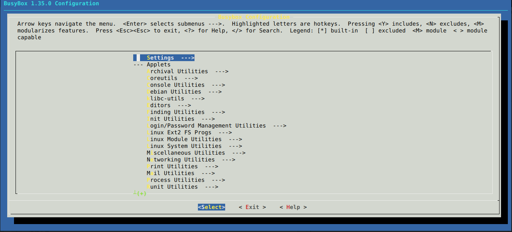
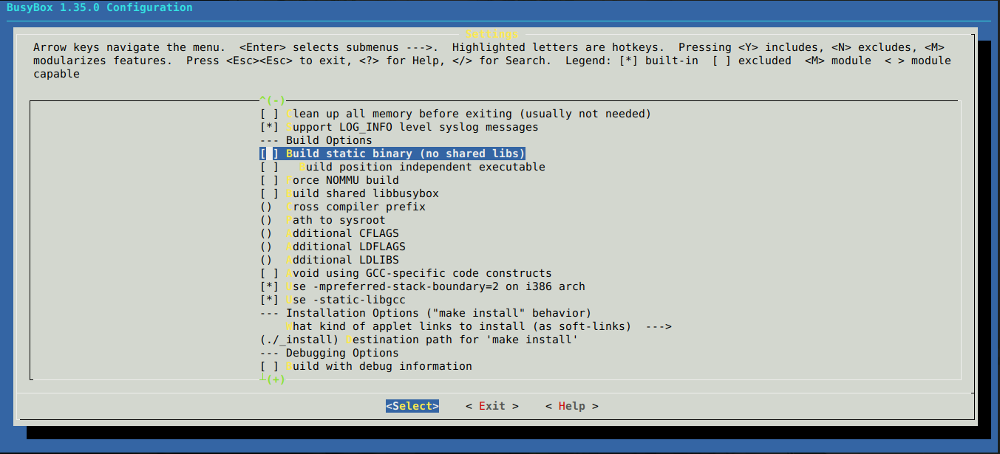
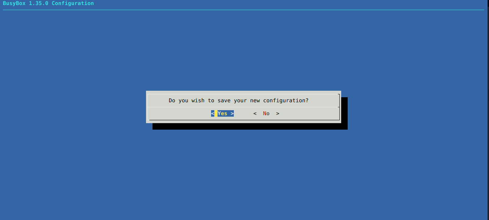

# 利用Busybox-httpd在电视盒子上搭建一个静态网站

- 2022/02/17 11:31:46

# 前言

相信大家一定有搭建网站的“梦想”，这是一个探索，就是利用httpd来搭建一个不简单的静态网页，而httpd可以集成在Busybox当中，最大的困难，也就是交叉编译Busybox了。网络上使用GitHub Pages的网页大多是用Hexo做成的，它可以把MarkDown文档渲染成静态网页，我们的目标就是使用Httpd来运行Hexo渲染的网页，这也非常简单！

# 思路
盒子是安卓系统，而安卓基于Linux，先查看盒子的架构，在安装相应的交叉编译工具，由于默认编译的busybox会在/usr/lib或/lib下查找共享库文件，而安卓系统并不具备所有的条件，所以我们将以静态方式编译。使用adb工具把编译好的二进制可执行文件和静态网页上传到安卓上，使用“busybox httpd”启动即可。

# 开始

## 编译Busybox

### 查看架构

我们需要使用adb连接到电视盒子，首先安装adb.

```bash
sudo apt install android-tools-adb -y
```

我选择用网络连接盒子，需要查看盒子的ip地址，可以登录路由器后台查看：


我的是192.168.1.26
用adb命令连接它：

```bash
adb connect 192.168.1.26
```

运行后是这样的：

```bash
#运行后实录
* daemon not running; starting now at tcp:5037
* daemon started successfully
connected to 192.168.1.26:5555
```

然后查看：

```bash
adb shell uname -a
```

这段是指，使用电视盒子下安卓系统上的默认终端执行"uname -a"
我的运行后是这样的，不同的机器可能不同：

```bash
Linux localhost 3.10.0_s40 #1 SMP Thu May 28 18:02:20 CST 2020 armv7l GNU/Linux
```

可以看到，这个盒子是armv7l的，可以说是arm32.那么交叉编译器就是arm开头，

### 安装交叉编译工具

但是，软件源中的gcc交叉编译工具一般是这种格式：gcc-arm-linux-gnueabi.安装这个是可以的，一般安装后可以自动转成：arm-linux-gnueabi-gcc.也可以直接下载交叉编译器的压缩包，解压并设置环境变量就好了（环境变量博客里专门有教程）.
输入这个，如果输出版本信息就ok：

```bash
arm-linux-gnueabi-gcc -v
```

### 下载Busybox源码

#### 对于wget

```bash
sudo apt install wget -y
```

```bash
wget https://busybox.net/downloads/busybox-1.35.0.tar.bz2
```

#### 对于curl

```bash
sudo apt install curl -y
```

```bash
curl -O https://busybox.net/downloads/busybox-1.35.0.tar.bz2
```

### 解压Busybox源码

```bash
tar xvf ./busybox-1.35.0.tar.bz2  
```

切换工作目录

```bash
cd busybox-1.35.0
```

### Busybox编译前配置

#### 安装make

既然要用makefile，必须要有make啊...

```bash
sudo apt make -y
```

#### 正式配置

```bash
make CROSS_COMPILE=arm-linux-gnueabi- ARCH=arm defconfig
```

这里的"CROSS_COMPILE="指定交叉编译器，"arm-linux-gnueabi-"是我们要用到的交叉编译器前缀，简单来说就是arm-linux-gnueabi-gcc除掉gcc以外的部分，一般这是个变量，编译时需要交叉编译工具时，会在gcc或ld前自动加上arm-linux-gnueabi-，如果不指定，就是利用系统默认的gcc编译，编译获得的二进制文件的架构就是编译主机的架构.

```bash
make CROSS_COMPILE=arm-linux-gnueabi- ARCH=arm menuconfig
```

会启动一个“图形化菜单”，利用方向键以移动，enter键确定，空格键选中.



Enter:**Settings**



空格:**[ ] Build static binary (no shared libs)**

然后ESC+ESC退出整个菜单，选择保存



### 正式编译

```bash
make CROSS_COMPILE=arm-linux-gnueabi- ARCH=arm
```

### 成功编译

如果在目录下看到一个叫做busybox的可执行文件，就半成功了.

我们用file命令查看busybox的架构：

```bash
file ./busybox

#运行后实录
./busybox: ELF 32-bit LSB executable, ARM, EABI5 version 1 (SYSV), statically linked, for GNU/Linux 3.2.0, BuildID[sha1]=9d5381f93c45bd41ce7b5a9a18b795b12652ab07, stripped
```

32位arm Soc，完全成功！

## 上传busybox

```bash
adb push ./busybox /sdcard
```

指的是：使用adb把当前目录下的busybox上传到安卓设备（电视盒子）的/sdcard目录下

## 上传网页

也可以自己写一个Html，我选择Hexo，简单且高效，关于Hexo的配置，我推荐官方文章：https://hexo.io/zh-cn/docs

比如说我们已经有一个网站文件夹public，将它上传至/sdcard

```bash
adb push ./public /sdcard
```

没想到吧，也可以上传整个文件夹.
接下来就进入盒子的远程shell来配置吧.

## 开始搭建

```bash
adb shell
```

进入盒子shell

```bash
cd /sdcard
```

切换到上传文件所在目录

```bash
chmod +x ./busybox
```

busybox有可能不可以执行，给它可执行权限.

```bash
./busybox
```

可以看到输出了一大堆命令.
使用以下命令开启httpd:

```bash
./busybox httpd -h public -p 8080
```

httpd命令用法：httpd -h 网站根目录 -p 网站端口号，一般80，8080就是保险一点.
用浏览器访问"盒子ip:8080"，就可以看到网页了.

# Q&A

## 执行busybox时,"/system/bin/sh: ./busybox: not executable: magic 7F45"

**编译错架构了，重新编译**

## /system/bin/sh: ./busybox: No such file or directory

**没有上传或者编译配置时没有勾选静态编译**

## 有没有偷懒的方法（不编译）

**直接去busybox.net/downloads/binaries/找到相应架构的二进制文件下载上传**

# 视频演示

<iframe src="//player.bilibili.com/player.html?aid=679101618&bvid=BV11m4y1d7sx&cid=509689609&page=1" scrolling="no" border="0" frameborder="no" framespacing="0" allowfullscreen="true"> </iframe>

# 最后

**我会在在此发出使用于Qemu的busybox编译文件img.gz**

# 资源

**Busybox即FileSystem仓库 ==> https://gitee.com/canyan233/qemu-ctrl-ready-repo**

