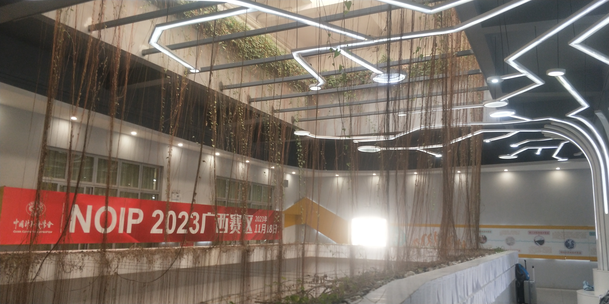
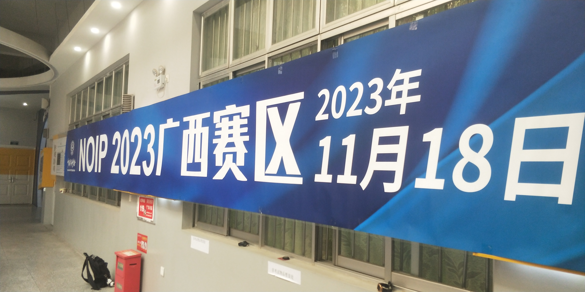
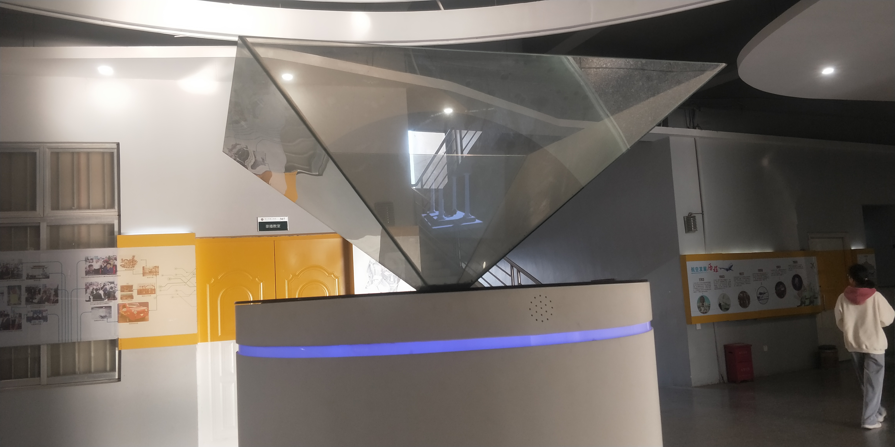
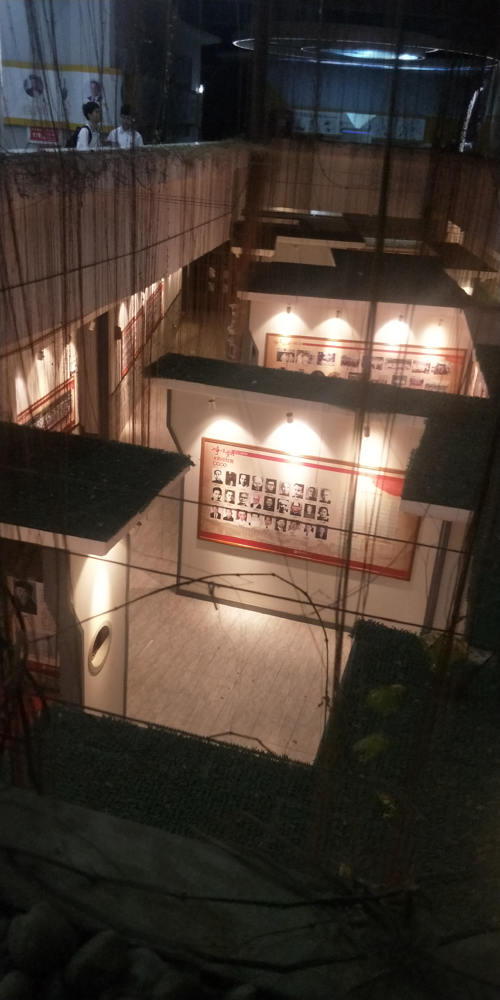

# 2023 年度总结
- 2024/01/20 20:37:01

---

# 关于操作系统项目

其实这个项目仓库正式地公布是在 **2023/04/22** 的 Gitee 但是由于各种原因, 大家看到的日期或早或迟, B站的视频的起源在 **2023/05/20**, 当时的我正在面临各种压力, 包括学业等. 也正是在这一天, 我拿着刚刚重构的代码, 兴冲冲地发出了这个视频.

额, 不要问我声音为什么这么混浊, 首先我没有好的麦克风, 在则对于一个久久不会出门的 阿宅 来说不会说话也真的是抱歉呢.

这一年结束, 我已经将项目推进到了 **磁盘驱动** 的部分了, 一月我争取完成虚拟文件系统.

这一年结束了我还是卡在 Protocol 的一期视频的制作上, 主要是前面落下好多东西, 除了补充, <strike> Protocol 的讲述也十分考验我的语文能力 </strike>

## 我是如何入坑的

> 本来没有打算进入这个领域的, 但是踏入了就感觉很有意思了

我是这个系列最初的一个 "擦边" 视频 ([BV1Ki4y1R79w](https://www.bilibili.com/video/BV1Ki4y1R79w/)), 涉及到了操作系统的领域, 有人骂过我技术不行, 我那时确实就是一个萌新, 但是真的不是什么破手机编译, 如果他的条件跟我一样使用一台和我同岁的电脑, 也一定不会效率高. 也有人鼓励我, 真的很感谢他们:

我的 "老师" 是 **谭玉刚**, 是他的视频帮助我完成了 C 语言 以及 UEFI/操作系统 的过渡. C语言我早就学完了, 是跟着 **小甲鱼老师** 学的, 他的讲解也许不是太好, 但是可帮了我大忙, 别人的教程用的是 Windows, 他使用的是 CentOS, 帮我打下了一定的基础.

> 在此我还是发表一下我的 "暴论"
>> Windows 环境的 C/C++ 学习比不上 Linux, 这取决于 UP 主, 学习的环境应该是清爽的, 因此我大多不会看那些屏幕上繁杂的视频, 比如教程挂一个 QQ 什么的. 我感觉使用 Windows 环境, 处理得最好的就是 **踌躇月光** 的, 整个视频下来只看得到与内容相关的软件.
>> 另外 Visual Studio 并不适合初学者, 使用 gcc 手动编译可以让我们更加了解一个程序的开发周期.
>> 使用 Linux 的另一个原因是: 字符显示问题, 如果是市面上常见的 Linux 发行版, 大都可以开箱即用, 在显示中文这方面完全不需要人担心,即使是 Arch Linux, 进行必要的工作时候都可以很舒服地显示...
>> 我想这需要人自己来权衡, Windows 可以用 **WSL2 + VSCode** 的形式来学习 C/C++, 这是一种两全其美的方法

## 代码规范?

我的代码风格已经很明显了, 与常人不同, 好像不太讲究他人的代码美学, 当然不是不喜欢, 我只是想 给这个练手的操作系统极大的风格罢了, 既然来了, 就让别人印象深刻一点吧, 如果是 **Pull Request**, 大致有个驼峰就行了, 等我长大一点再出一个代码规范的 markdown

如果是普通项目, 我尽力模范我喜欢的规范 (linux 内核的一套).

## 关于 PrintK

这是我挺引以为傲的了!!!

# 关于 Vim

> 无他，惟手熟尔

当然好多东西我都不会, 加油学吧!

# 关于 其他计算机方面

- 2023/12/31 - 2024/01/01 - 七小时 速通 一言服务器 与零基础 安卓应用 开发
    - 其实就是帮班级开发一个网站, 我选用的是 [MDClub](https://www.mdclub.org/) 的论坛系统, 但是由于没有备案支持, 我只能使用 ip 访问, 但是人家家长总不可能记 ip 吧, 为了方便, 我只能写一个安卓应用, 写死 ip 地址. 还是建议有能力的去备一下案呢, 我也是无奈啊, 又不好麻烦团委... 一言是我自己的打算, 用的是我的扫帚 Node.js ...

# NOIP 2023

我这两个月一路 "狗爬", 终于看到了久违的 **NOIP 2023**

> 我去的南宁, 人生中的第一次首府之旅

> 这个垂下来的好好看!!!

> 这个全息投影从没在学校里见过

> 这是条条下面的东西, 好像是个展览

# 期考!

来到新学校的第一次超大考!

# 关于未来

**TODO List for the new year!**

* 学业进步!
  * 了解微积分
  * 开阔视野
* 提升算法技能
* 操作系统项目代码规范
* 操作系统开发辅助工具

