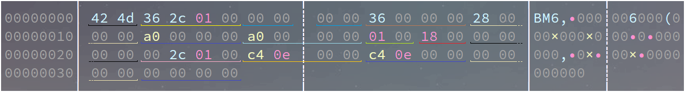

# Bmp文件结构详解

- 2022/08/27 16:00:00

# 前言(废话)

欢迎纠错: 

Bilibili : <a href="https://space.bilibili.com/503518259" >Maouai233</a>

Mail : Maouai233@outlook.com

---

最近(指这几个月...),在研究UEFI的**GraphicsOutputProtocol**的时候,图像显示我一直是很蒙的,于是我刨根问底,还是刨出来了这篇文章......

# 注意

**本文章使用标准的、最通用的Bmp图像试验,位图信息头使用BITMAPINFOHEADER.不经过如哈夫曼算法压缩像素数据的图像.也会说明调色板的使用**

# 正文
示例图像: (本文**bedrock.bmp**指此图文件名)


## 结构

### 概览Overview

在安装**hexyl**的前提下使用`hexyl -c 54 bedrock.bmp`即可看到我们使用Bmp时不可或缺的数据——位图文件头(Bitmap File Header)和位图信息头(Bitmap Info Header),它们共占54个字节(12 + 40):



**二维数组**.整型均以**小端存储序**存储.

| 位置(相对文件开头偏移字节) |    数据类型    | 大小(字节) | 作用                                                         | 默认值                           | 名称(可供C语言等参考) |
| :------------------------: | :------------: | :--------: | ------------------------------------------------------------ | -------------------------------- | --------------------- |
|             1              |     字符型     |     1      | **标识**此图为Bmp位图文件                                    | 0x42(ASCII即'B')                 | CharB                 |
|             2              |     字符型     |     1      | **标识**此图为Bmp位图文件                                    | 0x4D(ASCII即'M')                 | CharM                 |
|           3 ~ 6            | 32位无符号整型 |     4      | Bmp整个**文件的大小**(包括Bmp File Header等)                 |                                  | Size                  |
|           7 ~ 8            |       -        |     2      | **保留**                                                     | 视具体情况而定,一般为 0          | Reserved1             |
|           9 ~ 10           |       -        |     2      | **保留**                                                     | 视具体情况而定,一般为 0          | Reserved2             |
|          11 ~ 14           | 32位无符号整型 |     4      | 记录**像素数据**相对于整个文件开头的**偏移字节**             | 视具体情况而定,24bit位图一般为54 | ImageOffset           |
|          15 ~ 18           | 32位无符号整型 |     4      | **Bitmap Info Header** 大小(字节)                            | 40                               | HeaderSize            |
|          19 ~ 22           |    32位整型    |     4      | 位图**宽**度(像素),但不可为负(正常情况下大多软件不支持包括ffplay) | 正整数值                         | Width                 |
|          23 ~ 26           |    32位整型    |     4      | 位图**高**度(像素),如果为**负数**,具体见下文"像素存储"... |                                  | Height                |
|          27 ~ 28           | 16位无符号整型 |     2      | 必须是 1,Wiki上写的是**色彩平面数**                          | 1                                | Planes                |
|          29 ~ 30           | 16位无符号整型 |     2      | 像素所占位数,也就是图像**位深**、**色深**,值可能为1、4、8、24、32.如32bit用4字节存储一个像素 |                                  | ImageBits             |
|          31 ~ 34           | 32位无符号整型 |     4      | 压缩方式(**本文**不展开叙述)                                 | 0                                | CompressionType       |
|          35 ~ 38           | 32位无符号整型 |     4      | ImageSize                                                    | 见下                             | ImageSize             |
|          39 ~ 42           | 32位无符号整型 |     4      | **横**向分辨率(像素/米)                                      |                                  | HorizontalResolution  |
|          43 ~ 46           | 32位无符号整型 |     4      | **竖**向分辨率(像素/米)                                      |                                  | VerticalResolution    |
|          47 ~ 50           | 32位无符号整型 |     4      | **调色板颜色数**,等于"2^位深",即**2的位深值的次方个**, **24**Bit以上由于直接存储BGR(或BGRA)值,调色板个数为**0** | $2^{位深}$                       | PaletteColorsNum      |
|          51 ~ 54           | 32位无符号整型 |     4      | 重要颜色数,为0则是全部颜色都很重要                           | 0                                | ImportantColorsNum    |


### 偏移ImageOffset

Bmp像素数据起始位置相对于文件起始处的偏移.一般的:

$ImageOffset=54+4\times PaletteColorsNum$

假若bedrodk.bmp在内存中文件起始位置为**BmpRaw**,则像素数据起始位置为**PixelStart = BmpRaw + ImageOffset**

### 位深ImageBits

Bmp位深多少,即用多少各Bit存储一个像素.

如1Bit使用0.125个字节存储一个像素,其余的按四字节对齐(不足的按四字节算).

在一定范围内,位深越大,带给人的感受越真实.

32Bit的Bmp位图,使用**BGRA**即[Blue,Green,Red,Alpha]进行对像素的存储,比24Bit位图的**BGR**多了一条Alpha通道.

### 调色板BmpColorMap

每个调色板占用4个字节,存储格式为**BGRR**,即[Bule,Green,Red,Reserved],每个值都是**8Bit无符号整型(即unsigned char)**.下面C/C++的定义应该更加直观.

```c
typedef struct _BMP_COLOR_MAP
{
  UINT8   Blue;
  UINT8   Green;
  UINT8   Red;
  UINT8   Reserved;
} BMP_COLOR_MAP;
```

相当于一个**索引**,打个比方:

在一张8Bit的Bmp位图中,使用8个Bit即1字节存储一个像素.那么一个像素需要一个字节存储,则一个字节可存储0 ~ 255的无符号整型数据.如果有一个字节存储的值是255,则对应的第255个调色板BGRR值为 [0xFF 0xFF 0xFF 0x00].

一般情况下，需要"翻译"成24Bit或32Bit.具体见下文.

一张24Bit或32Bit的Bmp位图不存在调色板,因为它们直接存储像素的具体BGR或BGRA值,则$PaletteColorsNum = 0$

### 文件大小Size

$Size = 54 + ImageSize + PaletteColorsNum \times 4$

其中,4指的是每个调色板占用的字节数,54指的是Bmp文件头和位图头的总大小.

### 调色板个数PaletteColorsNum

在ImageBits不为24或32的情况下(具体见上文-调色板BmpColorMap):

$PaletteColorsNum = 2^{ImageBits}$

为24或32时:

$PaletteColorsNum = 0$

### 对齐后像素数据大小ImageSize

用数学公式说有点迷糊(我也还没学MOD)

要对齐时:

$RowSize=\frac {Width\times ImageBits} {8} +4 -  (\frac {Width\times ImageBits} {8} \mod 4)$

不用对齐时:

$RowSize = \frac {Width\times ImageBits} {8}$

对于所有情况,都有:

$ImageSize=Height\times RowSize$

_________

*RowSize*即储存一行的像素数据所需要的字节数.

ImageSIze代表一张Bmp图像储存像素区域所占的字节数.

_________

要对齐时的情况推导:

Bmp图像在储存数据时,记录范围内的每个像素(或调色板信息),会进行四字节对齐(不满四字节按四字节算).

则储存一行时不对齐情况下的字节数是:$\frac {ImageBits} 8\times Width$

不考虑多出字节进行4字节对齐时,多出字节数为:$(\frac {ImageBits} 8\times Width) \mod 4$

则考虑多出字节进行4字节对齐时,需补齐字节数为:$4-[(\frac {ImageBits} 8\times Width) \mod 4]$

则一行占用: $RowSize=\frac {Width\times ImageBits} {8} +4 -  (\frac {Width\times ImageBits} {8} \mod 4)$

再回去想想就行了...(指去上文QwQ)

### 宽度Width & 高度Height

Width不可为负数.

Height可为负数.影响见下文.

## 像素存储

正常情况下,Bmp会形成一个$Width \times Height$大小的数组,这里称BmpRaw,存在对齐情况,实际描述为二维数组,但在存储或读取时大多使用线型.

Height为正数时,实际平面内最左上角的数据起始位置在BmpRaw的最后行的第一列,即BmpRaw[(Height - 1)\*Width + 1],为负数则在BmpRaw的第一行的第一列,即BmpRaw[0].

## 读取&使用方案梗概

### 读取

可以把BmpFileHeader和BmpInfoHeader合并为一体,称**BMP_IMAGE_HEADER**,C/C++可用结构体,较为方便.

```C
#pragma pack(1)

typedef struct {
  UINT8   Blue;
  UINT8   Green;
  UINT8   Red;
  UINT8   Reserved;
} BMP_COLOR_MAP;

typedef struct {
  CHAR8         CharB;                        // BMP的标识符,必须为'B'
  CHAR8         CharM;                        // BMP的标识符,必须为'M'
  UINT32        Size;                         // BMP文件大小,Byte
  UINT16        Reserved1;                    // 保留
  UINT16        Reserved2;                    // 保留
  UINT32        ImageOffset;                  // BMP图像像素起始位置相对于头部的偏移
  UINT32        InfoHeaderSize;               // Bmp Info Header大小,40 B
  INT32         Width;                        // BMP图像宽
  INT32         Height;                       // BMP图像高
  UINT16        Planes;                       // 为 1
  UINT16        ImageBits;                    // BMP图像位深
  UINT32        CompressionType;              // 压缩方式
  UINT32        ImageSize;                    // 图像对齐时像素数据大小
  UINT32        HorizontalResolution;         // 横向分辨率
  UINT32        VerticalResolution;           // 纵向分辨率
  UINT32        PaletteColorsNum;             // 调色板颜色数
  UINT32        ImportantColorsNum;           // 重要颜色数
} BMP_IMAGE_HEADER;

#pragma pack()
```

可以通过两种方式读取:

1.   根据占用大小,依次读取数据放入结构体中.

2.   直接读取进入结构体,这就是为什么加入预处理指令`#pragma pack(1)`和`#pragma pack()`使结构体不进行字节对齐.

### "翻译"

一般情况下,24Bit的像素数据或类似24Bit像素数据会比较通用.比如UEFI下Blt函数传输(EfiBufferToVideo,从缓冲区到屏幕)的BltBuffer,使用**BGRR**即[Blue,Green,Red,Reserved]的格式,32、24Bit以外的都不是直接存储像素RGB值,使用调色板翻译就是一件必不可少的工作.

针对图像会倒转的问题,可以这样解决:
1.   在"翻译"阶段将数据根据实际情况进行摆放.

2.   在"翻译"阶段跑完后对数据根据实际情况进行翻转.定义一个函数如:BmpTransform

数据?拿来吧你!

# 资源附

16位深的转换等我写完才去研究,其他的就等一下放我的Edk2项目的源码吧......咕咕咕咕咕咕咕咕咕咕咕咕咕咕咕咕咕咕

[AARCH,ARM,X64,IA32] Bmp位图检查程序BmpChecker及源代码:        https://pan.baidu.com/s/1EUXCNEz7yGbVPIlCPng0Fw?pwd=2333
适用于UEFI的Bmp位深转换:  https://gist.github.com/ljQAQ233/5eaf1c600fcbb773749150efc73ab575

